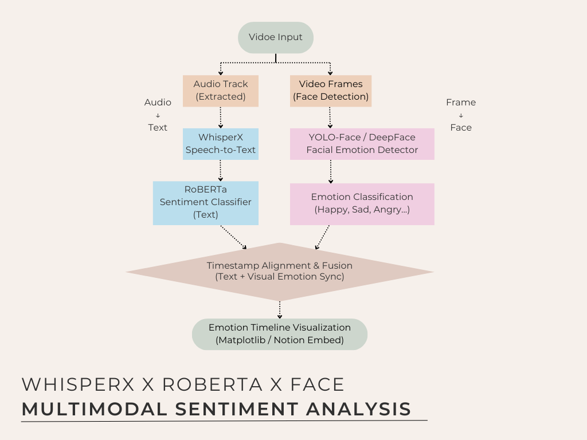

# Multimodal Emotion Analyzer for Mandarin Workplace Videos
This project presents a multimodal sentiment analysis pipeline tailored for Mandarin-language workplace videos. By integrating audio, textual, and visual modalities, the system performs per-second emotion predictions and aligns them with human annotations.

## 🔍 Project Overview
The system processes real-world workplace lecture videos, employing:
- Audio Processing: Utilizes WhisperX for precise speech-to-text alignment.
- Textual Analysis: Applies a fine-tuned Chinese RoBERTa model to detect sentiment-laden words.
- Visual Recognition: Employs DeepFace to extract facial expressions and infer emotions.
- Temporal Fusion: Combines multimodal data into a unified merged_timegrid.csv structure for synchronized analysis.
- Visualization: Generates time-series plots and highlights segments with significant emotional shifts.

## 🧠 System Architecture
Diagram illustrating the integration of audio, text, and visual processing modules culminating in a unified emotion prediction output.

## 📁 Repository Structure
data/: Contains raw video files and extracted frames.
scripts/: Houses preprocessing and analysis scripts for each modality.
transcription_label_timegrid/: Stores aligned transcripts with timestamp annotations.
visual_emotion_output/: Includes facial emotion recognition results.
merged_timegrid.csv: Consolidated per-second emotion predictions across modalities.
analysis_report.md: Detailed evaluation comparing model outputs with human annotations.

## 📊 Evaluation Highlights
The system's predictions were benchmarked against human annotations, focusing on:
- Accuracy: Assessing the correctness of emotion predictions per modality.
- Temporal Consistency: Evaluating the alignment of predicted emotional shifts with actual events.
- Multimodal Synergy: Analyzing the benefits of integrating multiple modalities over single-modality approaches.

For comprehensive results, refer to analysis_report.md.

## 🚀 Getting Started
Clone the Repository:

``bash
git clone https://github.com/HUEI-JYUN-DEBBY-YEH/NLP_Multimodal_Sentiment_Analysis.git
cd NLP_Multimodal_Sentiment_Analysis
Install Dependencies:

``bash
pip install -r requirements.txt
Run the Pipeline:

``bash
python scripts/run_pipeline.py --input data/sample_video.mp4

View Results:
- Check merged_timegrid.csv for consolidated predictions.
- Visualizations are saved in the output/ directory.

## 🤝 Contributions
Contributions are welcome! Please fork the repository and submit a pull request for any enhancements or bug fixes.

## 📄 License
This project is licensed under the MIT License. See the LICENSE file for details.
For further details or inquiries, please contact Debby Yeh.
